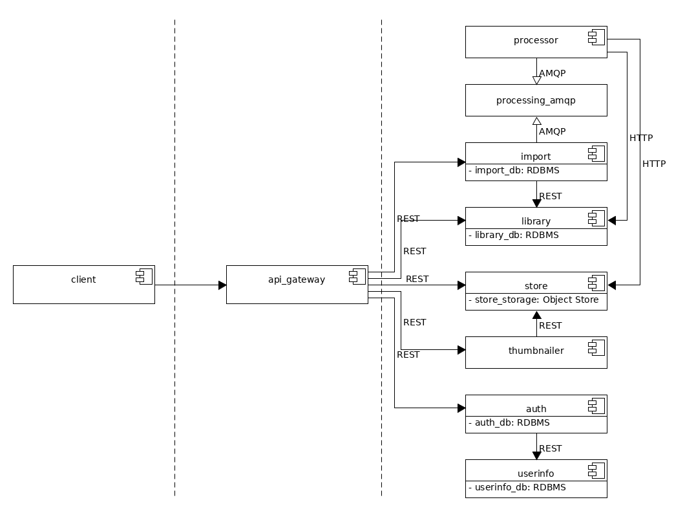
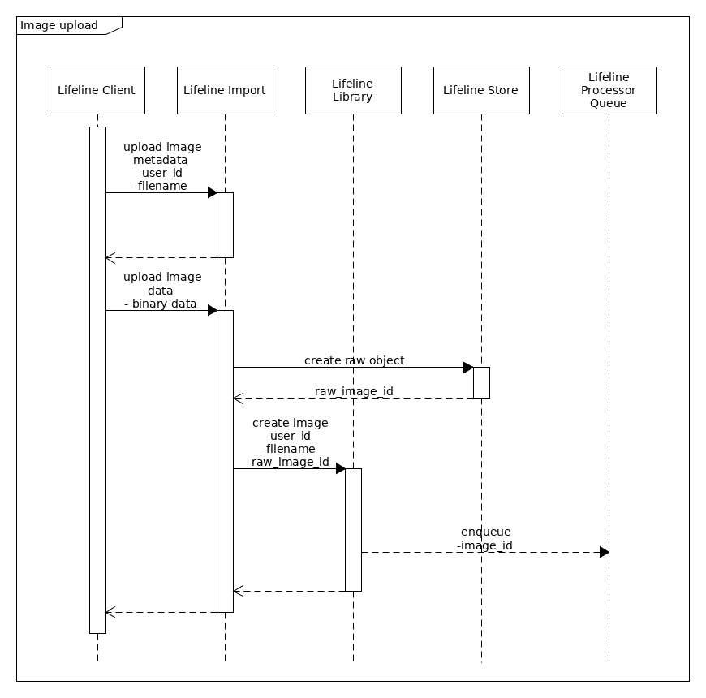
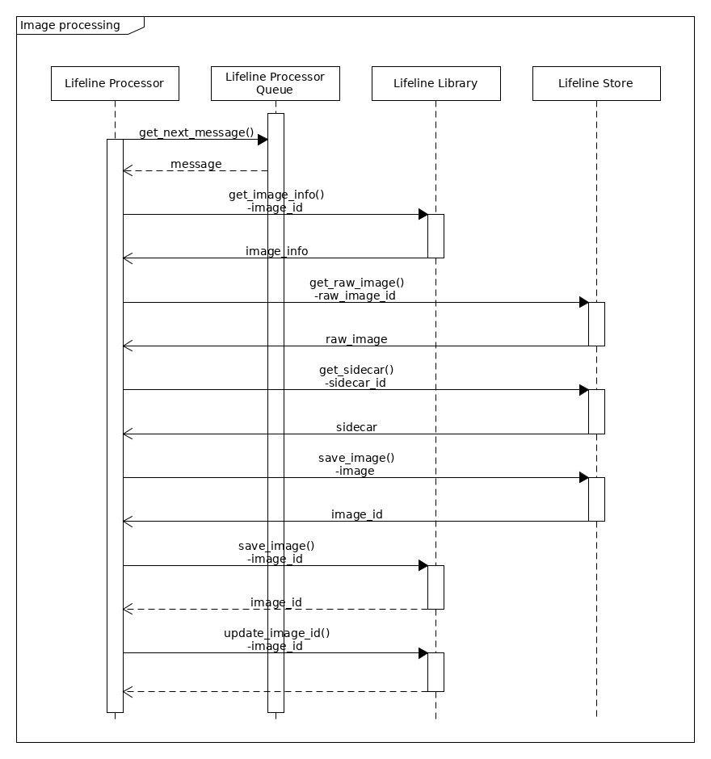

# Schani Documentation

Collection of (technical) documentations, mostly in UML.

## Architecture Overview

## Database Structure

### Library

## Sequence Diagrams

### Image Upload

### Image Processing

